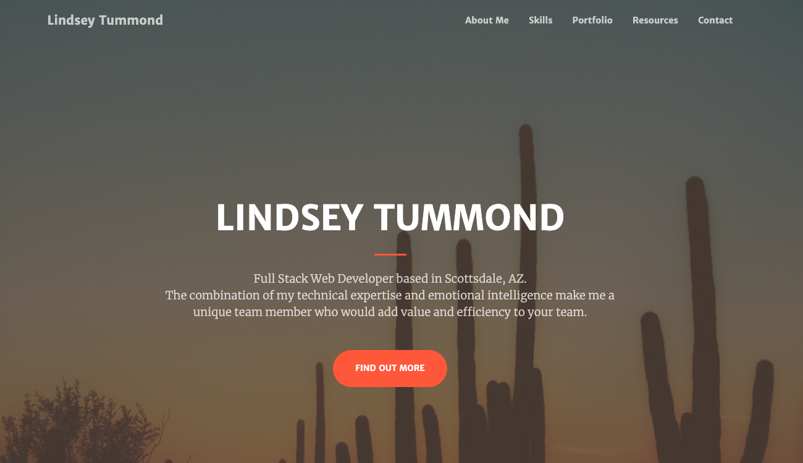

# Lindsey Tummond Portfolio

### Overview:

GitHub portfolio of independent and group projects showcasing Full Stack Web Development skills learned in the University of Arizona Coding Boot Camp.

### Link to Portfolio: https://lindseytummond.github.io/portfolio/

### Resources: 
  
    * HTML
    * CSS
    * Bootstrap
    * SASS
    * jQuery
    * Javascript
    * Firebase
    * MERN (MongoDB, Express.js, React.js, Node.js)
    * MySQL

